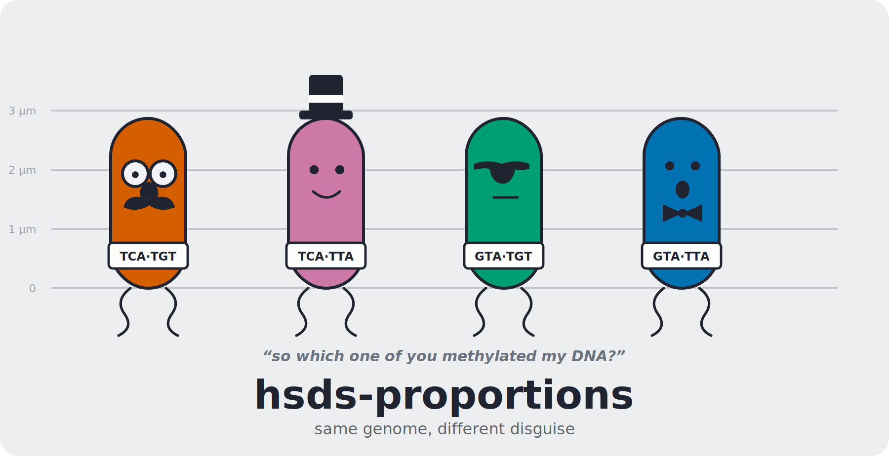

<p align="center">
  
</p>

<p align="center">
  <em>Work out which hsdS allele each long read came from, and how much of the
  population is carrying it.</em>
</p>

---

Many bacteria carry a Type I restriction-modification system whose specificity
subunit sits in a shufflon: the target recognition domains recombine, so a single
colony is a mixture of cells carrying different *hsdS* alleles. Each allele
methylates a different recognition motif, which means a long read with its 6mA
calls intact reports the allele of the cell it came from.

This tool reads a modified-basecalled BAM, assigns every read to an allele from
the motifs it carries, and reports the share of the population each allele
accounts for. It is organism agnostic. You supply the motifs, the spacer lengths
and the number of alleles; nothing about a particular species is built in.

## What it does

1. Filters reads on mean accuracy with Filtlong, then subsets the original BAM so
   the MM and ML tags survive. FASTQ cannot carry them, which is why the filter
   runs as a round trip rather than in place.
2. Walks the MM and ML tags of every read, keeps the 6mA calls above a
   probability threshold and outside the excluded sequence contexts, and looks for
   each allele's recognition motif with a methylated adenine at the expected
   offset. Reads are written to one BAM per allele.
3. Totals the bases behind each allele with NanoStat and writes a summary table.

## Installation

```bash
conda env create -f environment.yml
conda activate hsds-proportions
pip install -e .
```

Samtools, Filtlong and NanoStat have to be on PATH. The conda environment brings
all three. If you already have them, `pip install .` on its own is enough.

## Quick start

Describe your locus once in a JSON file, then point the tool at your BAMs:

```bash
cp "$(python -c 'import hsds_proportions,pathlib;print(pathlib.Path(hsds_proportions.__file__).parent/"presets"/"template.json")')" my_system.json
$EDITOR my_system.json
hsds-proportions /path/to/bams --motifs my_system.json -o results -t 8
```

`examples/four_allele_example.json` is a filled in version of the same file if you
would rather start from something concrete.

A few more ways to run it:

```bash
# two files, a lower probability floor, eight samtools threads
hsds-proportions bc05.bam bc10.bam --motifs my_system.json -p 240 -t 8 -o results

# eight barcodes at once, four samtools threads each
hsds-proportions /path/to/bams --motifs my_system.json -j 8 -t 4 -o results

# a BAM that has already been quality filtered
hsds-proportions filtered.bam --motifs my_system.json --skip-quality-filter
```

## Defining the motifs for your organism

A definition is a JSON document. The minimum is a forward motif per allele, with
`{spacer}` marking the unconstrained run between the two half sites:

```json
{
  "name": "My organism, hsdS locus",
  "genome_size": 4600000,
  "exclusions": [["CCWGG", 2], ["GATC", 1]],
  "families": {
    "alleleA": {"fwd": "TCA{spacer}TGT",  "spacer": 7, "offsets": [2]},
    "alleleB": {"fwd": "TCA{spacer}TTA",  "spacer": 7, "offsets": [2]},
    "alleleC": {"fwd": "GTAY{spacer}TGT", "spacer": 6, "offsets": [2]},
    "alleleD": {"fwd": "GTAY{spacer}TTA", "spacer": 6, "offsets": [2]}
  }
}
```

Points worth knowing:

- **IUPAC codes work everywhere.** `GTAY{spacer}TGT` requires a pyrimidine at
  position 4. Half sites of real Type I systems are often degenerate, and writing
  them out as plain ACGT silently loosens the motif.
- **The reverse motif is derived if you leave it out**, as the reverse complement
  of the forward one. Give `rev` explicitly only if you mean something that is not
  the reverse complement, and expect a warning if so.
- **Each allele can set its own spacer.** Two domains of the same system often
  space their half sites differently, so `spacer`, or `min_spacer` and
  `max_spacer` for a range, is read per family. `--min-spacer` and `--max-spacer`
  on the command line override all of them.
- **`offsets` is where the methylated adenine sits** within the match, counting
  from zero. A motif is only counted when one of those positions carries a 6mA
  call that passed the filters.
- **As many alleles as the locus has.** Four is what a two-by-two shufflon gives
  you, but nothing assumes that number.
- `genome_size` and `exclusions` are optional defaults that `--genome-size` and
  `--exclude` override.

A family whose half sites are all `N` is rejected rather than run, since such a
motif matches every read. That is usually a skeleton that was never filled in.

If you do not know your motifs yet, get them first: run each phase-locked strain
through NanoMotif or MEME and use the motifs it reports. This tool assigns reads
to motifs you already trust, it does not discover them.

Definitions you expect to reuse can be dropped into
`src/hsds_proportions/presets/` and called by name with `--preset`.

## Options

| Option | Default | What it controls |
| --- | --- | --- |
| `--motifs`, `--preset` | none, one required | Where the motif definition comes from |
| `-q, --min-quality` | 99.0 | Mean read accuracy as a percentage, passed to Filtlong |
| `-p, --min-probability` | 255 | Lowest 6mA probability accepted, on the 0 to 255 ML scale |
| `--min-spacer`, `--max-spacer` | from the definition | Override the spacer for every allele |
| `--exclude SEQ:OFFSET` | from the definition | Extra context whose calls are discarded, repeatable |
| `--mod-code` | `A+a.` | Modification code read from the MM tag |
| `--dominance-high/low/switch` | 0.90, 0.75, 5 | How dominant one allele has to be before a read is assigned |
| `--genome-size` | from the definition | Genome length behind the estimated depth column, 0 to omit |
| `-t, --threads` | 1 | Threads handed to samtools |
| `-j, --jobs` | 1 | Input files processed at once |
| `--skip-quality-filter` | off | Score the input as given |
| `--no-summary` | off | Skip NanoStat and write no summary table |

`hsds-proportions --help` has the rest.

## Output

One directory per input BAM, named after the sample and the thresholds used:

| File | Contents |
| --- | --- |
| `*_Q99_filtered.bam` | Reads that passed the accuracy filter |
| `*_<allele>.bam` | Reads assigned to each allele, one file each |
| `*_Ambiguous.bam` | Reads carrying motifs from more than one allele with no clear majority |
| `*_Other.bam` | Reads with no 6mA calls, no motifs, or no MM tag |
| `*_motifs.tsv` | Every motif occurrence, with its sequence and methylation pattern |
| `*_summary_report.tsv` | Read and base counts per allele, proportions, error rate |

In the methylation pattern, `M` marks a retained call, `m` a call dropped for
sitting in an excluded context, and `.` an unmodified base.

## How a read is assigned

A read carrying motifs from one allele only goes to that allele. Where more than
one is represented, one of them has to account for most of the occurrences: 90% on
reads with at least five motifs, 75% below that, on the grounds that a handful of
motifs is weak evidence and one miscalled base should not decide the call. Reads
that clear neither bar go to the ambiguous file rather than being forced into an
allele, and they are left out of the proportions.

## The error rate column

The summary reports one error rate per assigned read, the complement of three
probabilities multiplied together: correct demultiplexing, correct basecalling
across the informative bases of the motif, and a correct methylation call. With
the defaults, `0.999 x 0.99^5 x 1.0`, that is 4.9961%.

Two things to be aware of before quoting it. The exponent counts the fixed bases
flanking the methylated adenine rather than the full motif length, on the basis
that a miscall in the spacer does not change which allele a read matches. And the
methylation term is the probability threshold as a fraction of 255, which at the
default of 255 contributes nothing. Both are set by `--error-model-bases` and
`--barcode-accuracy`.

The estimated depth column divides the bases assigned to an allele by the whole
genome length, so it is a genome-equivalent depth and understates coverage at the
locus itself. Set `--genome-size 0` to leave it out.

## Known behaviour

Motif matches within a pattern are non-overlapping, which is the behaviour of
`re.finditer`. Two overlapping copies of the same motif count once.

By default the methylation pattern marks every raw 6mA call, including those below
the probability threshold. `--annotate-kept-only` restricts the marks to calls that
passed. This affects the pattern string in the TSV only, never which reads are
assigned where.

Reads are assigned on the motifs they happen to span, so short reads carry less
evidence than long ones. Proportions are reported per read and per base for that
reason, and the two are worth comparing.

## Requirements

Python 3.9 or later with pysam, plus samtools, Filtlong and NanoStat on PATH.

```bash
pytest          # the logic that does not need pysam or the external tools
```

## Citation

See `CITATION.cff`.

## Licence

MIT. See `LICENSE`.
